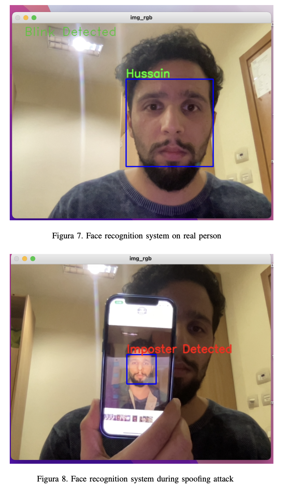

# Face-Recognition-System-with-Spoof-Detection

This project focuses on creating an accurate facial recognition system for an attendance system using various techniques such as dlib's face recognition module for face detection, a Siamese Network for feature extraction, and anti-spoofing techniques such as blink detection and a classifier to detect fake faces. The aim is to build a robust system that can recognize individuals accurately and reliably, even in challenging lighting conditions and with attempts at spoofing.

The first step of the implementation involved using diverse dataset of images containing faces, which was then used to train the Siamese Network. The network is than fine-tuned with the collected images of ourselves to obtain embeddings for each of our faces. These embeddings were then compared with the reference embeddings of people in the database, and when the distance was less than a threshold, it was classified as the same person, else it was classified as unknown.Here is link to dataset [Face Recognition Dataset - Oneshot Learning](https://www.kaggle.com/datasets/stoicstatic/face-recognition-dataset)

To further improve the system's robustness against spoofing attacks, the project incorporated an anti-spoofing classifier that used a convolutional neural network (CNN) to detect fake faces. The classifier was trained on a CelebA Spoof dataset of real and fake images and was able to accurately detect fake faces.Here is link to dataset [CelebA Spoof dataset](https://mmlab.ie.cuhk.edu.hk/projects/CelebA/CelebA_Spoof.html)

The final implementation involved putting all the modules together to create a facial recognition system for real-time use, specifically an attendance system. The system was able to recognize individuals accurately, but it had some limitations. For instance, it could only work with one face at a time, so the frame had to have only one face in it.

In conclusion, the project successfully implemented a facial recognition system for an attendance system that incorporated techniques such as face detection, feature extraction, and anti-spoofing. Although the system worked fine, there is still a lot of room for improvement, such as training the model on a more diverse dataset and for a longer time. Overall, the system was robust against face spoofing attacks but was limited in its ability to work with multiple faces simultaneously.

